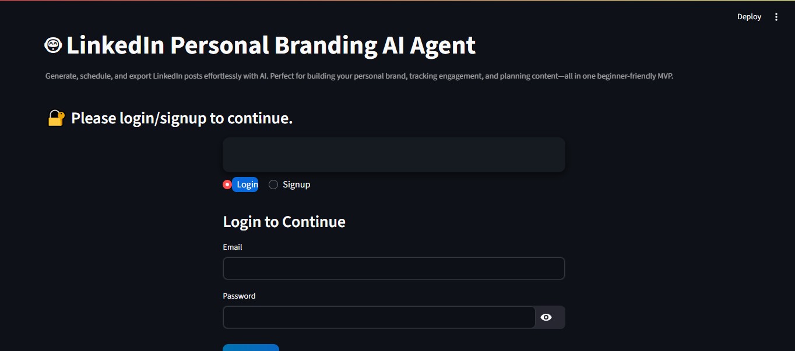
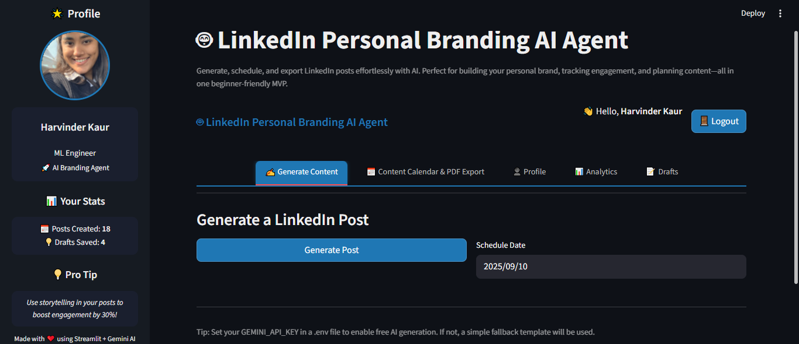
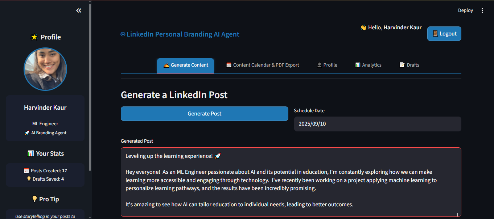

# 🤖 LinkedIn Personal Branding AI Agent🤖

[](https://www.python.org/)  
[](https://streamlit.io/)  
[](https://www.mysql.com/)  
[](https://ai.google.dev/)  
[](LICENSE)  

> **Generate, schedule, and export LinkedIn posts effortlessly with AI.**  
> Build your personal brand, track engagement, and plan content—all in one beginner-friendly MVP 🚀

---

## 📸 Demo Screenshots

| Login / Signup | Dashboard | AI Post Generator | Content Calender |
|----------------|-----------|-------------------|-----------|
|  |  |  |  |

---

## ✨ Features

### 🔐 Authentication
- Secure **signup/login** with hashed passwords.  
- Session-based access (only logged-in users).

### 👤 Profile Management
- Edit **name, role, industry, interests**.  
- Upload profile picture (circular avatar, auto-processed).

### 📝 AI-Powered Post Generation
- Generates **LinkedIn posts** from profile data.  
- Uses **Gemini AI** — **model: `gemini-1.5-flash`** — for smart content creation.  
- Fallback template if API key missing.

### 📂 Drafts System
- Save posts as **drafts** with schedule dates.  
- Publish or delete drafts anytime.

### 📅 Posts & Calendar
- View saved posts with **hashtags & schedule dates**.  
- Simulated engagement metrics: ❤️ likes + 💬 comments.  
- **Export posts to PDF** for records/sharing.

### 📊 Analytics
- Sidebar shows **posts, drafts, likes, comments**.  
- Instant feedback on engagement.

### 🎨 UI/UX
- Modern **Streamlit interface**.  
- **Dark theme** with clean layout.  
- Sidebar quick links + footer ❤️.

---
## 📂 Project Structure
    LinkedIn-AI-Agent/
    │
    ├─ app.py # Streamlit frontend & main app logic
    ├─ database.py # MySQL helpers & CRUD functions
    ├─ requirements.txt # Python dependencies
    ├─ .env # Gemini API key
    ├─ profile_pics/ # Stores user profile pictures
    ├─ Demo_Media/ # Screenshots and demo media
    └─ Demo_Script.md # Suggested demo flow for 10–12 mins

---

## ⚡ Quick Start

### 1️⃣ Clone repo
```bash
git clone https://github.com/yourusername/LinkedIn-AI-Agent.git
cd LinkedIn-AI-Agent
```
2️⃣ Setup virtual environment
```bash
python -m venv venv
source venv/bin/activate   # Linux/Mac
venv\Scripts\activate      # Windows
```
3️⃣ Install dependencies
```bash
pip install -r requirements.txt
```
4️⃣ Setup MySQL

Update `database.py` → `DB_CONFIG` with your MySQL credentials.

Run `init_db()` to create tables (`users`, `posts`, `drafts`).

5️⃣ Configure Gemini AI API (optional but recommended)

Create a `.env` file:
```bash
GEMINI_API_KEY=your_gemini_api_key_here

```
👉 How to get Gemini API key:

  - Go to Google AI Studio
  
  - Create a project and enable Gemini API.
  
  - Generate an API key from the console.
  
  - Copy the key and paste it into your `.env` file.

📌 Model used: `gemini-1.5-flash`

*Note*: If you do not have a Gemini API key, the app will automatically use a fallback template so you can still demo it.

6️⃣ Run app
```bash
streamlit run app.py
```
## 🖥 Walkthrough

  - Login / Signup → Create profile.
  
  - Generate Post → Edit, Save Draft, or Publish.
  
  - Export to PDF → Share outside LinkedIn.
  
  - Check Analytics → Posts, drafts, likes, comments in sidebar.

## 💻 Tech Stack

  - Frontend: Streamlit
  
  - Backend: Python, MySQL
  
  - AI: Gemini AI (gemini-1.5-flash)
  
  - Extras: Pillow (profile pics), reportlab (PDF export), python-dotenv

## 🌟 Sidebar Features

- Profile: Profile_Picture, Name, Role, AI Branding Agent tag.

- Real Stats: Posts, Drafts.

- Pro Tips: for user

- Footer: Made with ❤️ using Streamlit + Gemini AI.

## 🌟 Why this project?

✅ End-to-end full-stack app (Auth + DB + AI + UI).

✅ Real-world use case: LinkedIn branding & content marketing.

✅ Beginner-friendly MVP → easy to demo in interviews.

✅ Perfect for GitHub portfolio, LinkedIn showcase, and fresher jobs.

## ❤️ Credits

Made with Streamlit + Gemini AI + MySQL
**by Harvinder Kaur ✨**

